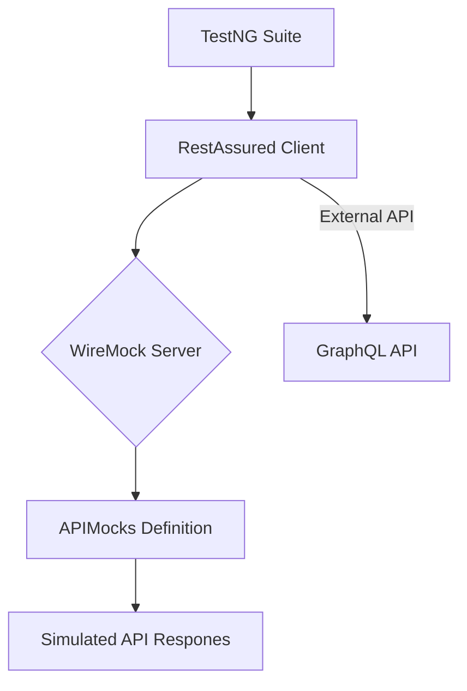
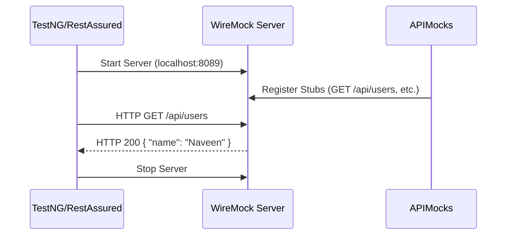

# API Mock Service & Virtualization with WireMock and RestAssured

[](https://www.oracle.com/java/)
[](https://maven.apache.org/)
[](http://wiremock.org/)
[](https://rest-assured.io/)

A comprehensive project demonstrating **API Mocking** and **Service Virtualization** using Java, WireMock, and RestAssured. This project showcases how to stub external services to enable independent testing of application components.

## 🚀 Key Features

*   **API Mocking**: Simulate various HTTP methods (GET, POST, DELETE) with custom responses.
*   **Service Virtualization**: Create virtual endpoints to mimic real service behavior.
*   **GraphQL Testing**: Integration tests for GraphQL APIs (Rick and Morty API).
*   **Query Parameter Handling**: Advanced stubbing with URL path and query parameters.
*   **Automated Testing**: TestNG-based test suite for verifying mock behavior.

## 🏗️ Architecture Overview

The project follows a modular structure where API stubs are defined separately from the test logic.



### Sequence Diagram: Mock Interaction



## 📂 Project Structure

```text
APIMockServiceVirtualization/
├── src/
│   ├── main/java/org/mock/api/
│   │   ├── APIMocks.java        # Stub definitions
│   │   └── WireMockSetup.java   # Server configuration
│   └── test/java/
│       ├── com/graphql/api/
│       │   └── GraphQLAPITest.java  # GraphQL integration tests
│       └── org/mock/api/            # Unit-style tests for mocks
│           ├── MockGETUserTest.java
│           ├── MockPOSTCreateUserAPITest.java
│           └── ...
├── pom.xml                      # Maven dependencies
└── README.md                    # Project documentation
```

## 🛠️ Technologies & Libraries

*   **Java**: Core programming language.
*   **Maven**: Build and dependency management.
*   **WireMock**: Library for stubbing and mocking web services.
*   **RestAssured**: Java library for testing and validating REST services.
*   **TestNG**: Testing framework for Java.

## 🏁 Getting Started

### Prerequisites

*   JDK 11 or higher
*   Maven installed

### Installation

1.  Clone the repository:
    ```bash
    git clone https://github.com/karanAtreya1986/nk_api_mock_service_virtualisation.git
    ```
2.  Navigate to the project directory:
    ```bash
    cd APIMockServiceVirtualization
    ```

### Running Tests

You can run the tests using Maven:
```bash
mvn test
```

## 📝 Example Usage

### Creating a Mock
```java
public static void getDummyUser(){
    stubFor(get(urlEqualTo("/api/users"))
            .willReturn(aResponse()
                    .withStatus(200)
                    .withHeader("Content-Type", "application/json")
                    .withBody("{\"name\": \"Naveen\"}")));
}
```

### Testing the Mock
```java
@Test
public void testGetUser() {
    RestAssured.given()
        .when()
        .get("http://localhost:8089/api/users")
        .then()
        .statusCode(200)
        .body("name", equalTo("Naveen"));
}
```

---
Developed with ❤️ by Karan Atreya
